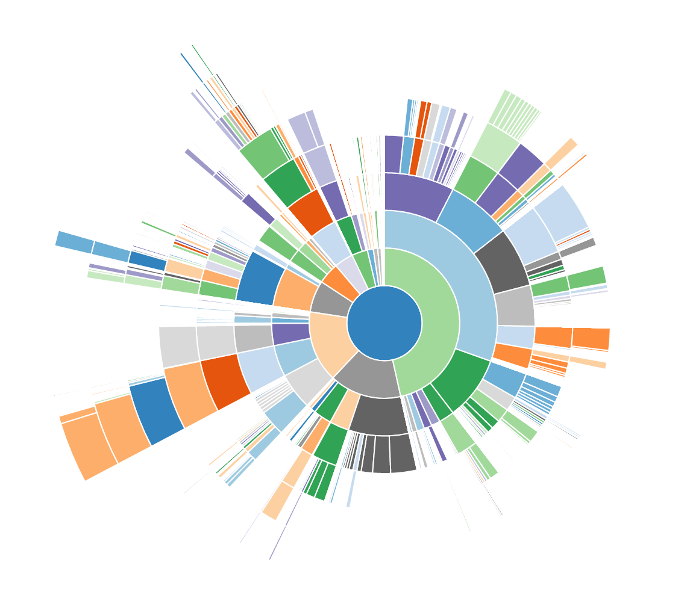

# git-baobab
Visualize git history in a sunburst chart much like [Disk Usage Analyzer](https://en.wikipedia.org/wiki/Disk_Usage_Analyzer).<br>
This is work in progress.

## Setup

```
$ git clone https://github.com/weliveindetail/git-baobab.git /path/to/git-baobab
$ ln -s /path/to/git-baobab/git-baobab /usr/local/bin/git-baobab
```

## Example

```
$ cd /path/to/llvm-project
$ git baobab HEAD~20
$ open /tmp/git-baobab-test.html 
```



## Credits

* D3.js &mdash; https://github.com/d3/d3
* Sunburst sample code &mdash; https://bl.ocks.org/mbostock/1306365
