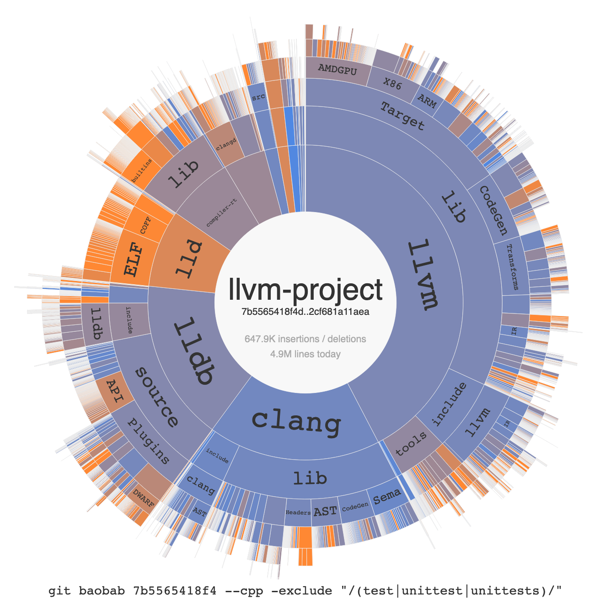

# git-baobab

In admiration of the [Baobab](https://en.wikipedia.org/wiki/Baobab_tree), the African tree of life: git-baobab visualizes life in a git repository as a sunburst-style hot-cold map, similar to [Disk Usage Analyzer](https://en.wikipedia.org/wiki/Disk_Usage_Analyzer).<br>

## Setup

```
$ git clone https://github.com/weliveindetail/git-baobab.git /path/to/git-baobab
$ ln -s /path/to/git-baobab/git-baobab /usr/local/bin/git-baobab
```

## Example

```
$ git clone https://github.com/llvm/llvm-project.git
$ cd llvm-project
$ git rev-parse HEAD
27ec195f391cf1bcf39fe25f345bc63061566c3c
$ git merge-base HEAD origin/release/8.x
7b5565418f4d6e113ba805dad40d471d23bca6f6
$ git baobab 7b5565418f4 --cpp "/(test|unittest|unittests)/"
Filter matches 11883 tracked files
Baobab: 4874226 lines today, 632801 lines changed since commit 7b5565418f4
Export chart to /var/folders/2k/myk8kt8d4f52dzr19331wtxr0000gn/T/tmpwd8qrcb1.html
Show in browser? [Y/n] y
```

Click on the image to open the original interactive output:

[](examples/llvm9-cpp-sources.html)

The example shows the accumulated changes in C++ files outside tests since Release 8.0 branched on Jan 16, 2019. The size of an arc represents the amount of change in a file/directory relative to its sibling files/directories. The color of an arc indicates the amount of change relative to its line count today. The amount of change is the sum of insertions and deletions.

## Usage

Reduced help page

```
usage: git-baobab [-size 100%%] [-filter .*] [-exclude .*]
                  [<file extension filters>]
                  [-d3js https://d3js.org/d3.v5.min.js]
                  [-md5js https://cdnjs.cloudflare.com/ajax/libs/blueimp-md5/2.10.0/js/md5.min.js]
                  since

positional arguments:
  since                 git commit to start analysis from

optional arguments:
  -h, --help            Show this help message and exit
  -size 100%%           Display size of the resulting image as CSS length
                        value
  -filter .*            Add the given regex to the file filter
  -exclude .*           Exclude matching files from the file filter
  -d3js https://d3js.org/d3.v5.min.js
                        URL to custom d3js variant (tested with v5)
  -md5js https://cdnjs.cloudflare.com/ajax/libs/blueimp-md5/2.10.0/js/md5.min.js
                        URL to custom script that provides a `md5()` function
                        (for GitHub integration)

include files with extensions:
  --actionscript        as, mxml
  --ada                 ada, adb, ads
  --asciidoc            adoc, ad, asc, asciidoc
  --apl                 apl
  --asm                 asm, s
  --asp                 asp, asa, aspx, asax, ashx, ascx, asmx
  --aspx                asp, asa, aspx, asax, ashx, ascx, asmx
  --batch               bat, cmd
  --bitbake             bb, bbappend, bbclass, inc
  --bro                 bro, bif
  --cc                  c, h, xs
  --cfmx                cfc, cfm, cfml
  --chpl                chpl
  --clojure             clj, cljs, cljc, cljx
  --coffee              coffee, cjsx
  --config              config
  --coq                 coq, g, v
  --cpp                 cpp, cc, C, cxx, m, hpp, hh, h, H, hxx, tpp
  --crystal             cr, ecr
  --csharp              cs
  --cshtml              cshtml
  --css                 css
  --cython              pyx, pxd, pxi
  --delphi              pas, int, dfm, nfm, dof, dpk, dpr, dproj, groupproj,
                        bdsgroup, bdsproj
  --dlang               d, di
  --dot                 dot, gv
  --dts                 dts, dtsi
  --ebuild              ebuild, eclass
  --elisp               el
  --elixir              ex, eex, exs
  --elm                 elm
  --erlang              erl, hrl
  --factor              factor
  --fortran             f, F, f77, f90, F90, f95, f03, for, ftn, fpp, FPP
  --fsharp              fs, fsi, fsx
  --gettext             po, pot, mo
  --glsl                vert, tesc, tese, geom, frag, comp
  --go                  go
  --groovy              groovy, gtmpl, gpp, grunit, gradle
  --haml                haml
  --handlebars          hbs
  --haskell             hs, hsig, lhs
  --haxe                hx
  --hh                  h
  --html                htm, html, shtml, xhtml
  --idris               idr, ipkg, lidr
  --ini                 ini
  --ipython             ipynb
  --isabelle            thy
  --j                   ijs
  --jade                jade
  --java                java, properties
  --jinja2              j2
  --js                  es6, js, jsx, vue
  --json                json
  --jsp                 jsp, jspx, jhtm, jhtml, jspf, tag, tagf
  --julia               jl
  --kotlin              kt
  --less                less
  --liquid              liquid
  --lisp                lisp, lsp
  --log                 log
  --lua                 lua
  --m4                  m4
  --make                Makefiles, mk, mak
  --mako                mako
  --markdown            markdown, mdown, mdwn, mkdn, mkd, md
  --mason               mas, mhtml, mpl, mtxt
  --matlab              m
  --mathematica         m, wl
  --md                  markdown, mdown, mdwn, mkdn, mkd, md
  --mercury             m, moo
  --naccess             asa, rsa
  --nim                 nim
  --nix                 nix
  --objc                m, h
  --objcpp              mm, h
  --ocaml               ml, mli, mll, mly
  --octave              m
  --org                 org
  --parrot              pir, pasm, pmc, ops, pod, pg, tg
  --pdb                 pdb
  --perl                pl, pm, pm6, pod, t
  --php                 php, phpt, php3, php4, php5, phtml
  --pike                pike, pmod
  --plist               plist
  --plone               pt, cpt, metadata, cpy, py, xml, zcml
  --powershell          ps1
  --proto               proto
  --ps1                 ps1
  --pug                 pug
  --puppet              pp
  --python              py
  --qml                 qml
  --racket              rkt, ss, scm
  --rake                Rakefile
  --razor               cshtml
  --restructuredtext    rst
  --rs                  rs
  --r                   r, R, Rmd, Rnw, Rtex, Rrst
  --rdoc                rdoc
  --ruby                rb, rhtml, rjs, rxml, erb, rake, spec
  --rust                rs
  --salt                sls
  --sass                sass, scss
  --scala               scala
  --scheme              scm, ss
  --shell               sh, bash, csh, tcsh, ksh, zsh, fish
  --smalltalk           st
  --sml                 sml, fun, mlb, sig
  --sql                 sql, ctl
  --stata               do, ado
  --stylus              styl
  --swift               swift
  --tcl                 tcl, itcl, itk
  --terraform           tf, tfvars
  --tex                 tex, cls, sty
  --thrift              thrift
  --tla                 tla
  --tt                  tt, tt2, ttml
  --toml                toml
  --ts                  ts, tsx
  --twig                twig
  --vala                vala, vapi
  --vb                  bas, cls, frm, ctl, vb, resx
  --velocity            vm, vtl, vsl
  --verilog             v, vh, sv, svh
  --vhdl                vhd, vhdl
  --vim                 vim
  --wix                 wxi, wxs
  --wsdl                wsdl
  --wadl                wadl
  --xml                 xml, dtd, xsl, xslt, xsd, ent, tld, plist, wsdl
  --yaml                yaml, yml
  --cmake               cmake, in (and CMakeLists.txt files)
```
